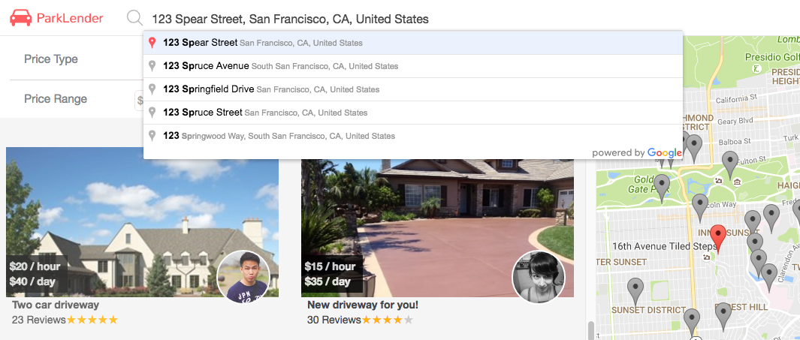

ParkLender is a parking space sharing app inspired by AirBnB. It utilizes Ruby on Rails and a PostgreSQL database for the back-end and React/Redux for the front-end.

Check it out live at: [https://www.parklender.com/](https://www.parklender.com/)

## Features and Implementation

### Google Maps API Integration

#### Spot Index and Bounds Filtering

To display the current spots on a map, a filtering pattern was implemented that would adjust to the bounds of the map through the use of google maps `idle` event. An `idle` event occurs when the google map is not being panned. As soon as the `idle` event occurs, the `bounds` are then retrieved from the google map component which is used to trigger a Redux cycle to update the filter used to determine which spots to display.

```javascript
google.maps.event.addListener(this.map, 'idle', () => {
  const { north, south, east, west } = this.map.getBounds().toJSON();
  const bounds = {
    northEast: { lat: north, lng: east },
    southWest: { lat: south, lng: west } };
  this.props.updateFilter('bounds', bounds);
});
```

#### Marker Management

ParkLender makes it easy to search for available parking spaces by customizing a Google Maps component where each spot is synced to a marker with custom hover events, animations, and info windows. After instantiating a `marker` object that references to a `spot` object, hover and click events can be custom made.

```javascript
const pos = new google.maps.LatLng(spot.lat, spot.lng);
const marker = new google.maps.Marker({
  position: pos,
  map: this.map,
  spotId: spot.id,
  icon: greyIcon
});
```


#### Autocomplete Place Input Field

A core feature in ParkLender's search optimization for spots is google's `autocomplete` API.

 ```javascript
 const autocomplete = new google.maps.places.Autocomplete(
   document.getElementById('autocomplete-search-field'),
   { types: ['geocode'] }
 );
 ```

 

 Google maps API provides a `place_changed` event listener for whenever the place in an autocomplete field is changed. Using this event and `getPlace`, a `place` object is retrieved with useful information such as address and coordinates to update the the `center` and `zoom` attributes of the map.

 In order to provide a sensible user search experience, the `zoom` attribute between `13` and `16` will vary depending if the user inputs a city or an exact street address.

```javascript
autocomplete.addListener('place_changed', () => {
  let place = autocomplete.getPlace();
  let zoom;
  if (place.adr_address.includes("address")) {
    zoom = 16;
  } else {
    zoom = 13;
  }

  let center = {
    lat: place.geometry.location.lat(),
    lng: place.geometry.location.lng()
  };

  this.props.map.setCenter(center);
  this.props.map.setZoom(zoom);
});
```

### Spot SQL Queries & Price Filtering


The price range and filter was developed to provide users an alternative way to find a parking spot. For this application, parking spaces are allowed an `hourly_rate`, `daily_rate`, or `monthly_rate`. In order to design a price type and price range filter, a custom SQL query was created to fit `min` and `max` conditions for the backend spots controller.

```ruby
# app/controllers/api/spots_controller.rb
def apply_price_filters(spots, price_types, min = 0, max = 100)
  price_types = %w(hourly_rate daily_rate monthly_rate) if price_types.empty?
  query = []
  price_types.each do |price|
    query << "#{price} BETWEEN #{min} AND #{max}"
  end
  spots.where(query.join(" OR "))
end
```

As a result, this query would include `zero` prices as well. Therefore, the `Price` presentational component filter out the `zero` prices at the frontend stage.

```javascript
export const Price = ({ prices }) => {

  const priceBlocks = [];

  for (let price in prices) {
    if (prices[price] > 0) {

      let cost = prices[price];
      let text = `$${cost} / ${priceKey[price]}`;
      let className = `price ${price}`;

      let priceBlock =
      <li className={className} key={price}>
        <span className='price-tag'>{text}</span>
      </li>;

      priceBlocks.push(priceBlock);
    }
  }

  return(
    <ul className='spot-prices'>
      {priceBlocks}
    </ul>
  );
};
```
