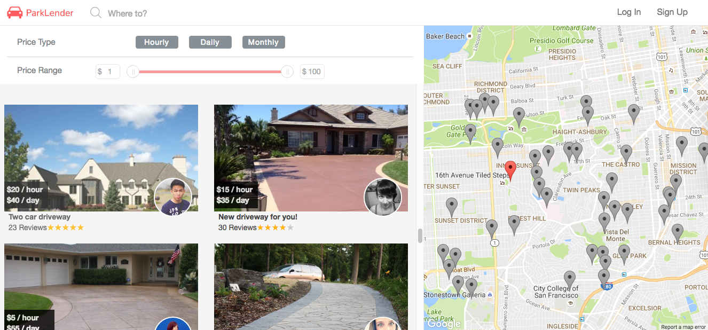

ParkLender is a parking space sharing app inspired by AirBnB. It utilizes Ruby on Rails and a PostgreSQL database for the back-end and React/Redux for the front-end.

Check it out live at: [https://www.parklender.com/](https://www.parklender.com/)

## Features and Implementation

### Google Maps API Integration

#### Spot Index and Bounds Filtering

To display the current spots on a map, a filtering pattern was implemented that would adjust to the bounds of the map through the use of google maps `idle` event. An `idle` event occurs when the google map is not being panned. As soon as the `idle` event occurs, the `bounds` are then retrieved from the google map component which is used to trigger a Redux cycle to update the filter used to determine which spots to display.

```javascript
google.maps.event.addListener(this.map, 'idle', () => {
  const { north, south, east, west } = this.map.getBounds().toJSON();
  const bounds = {
    northEast: { lat: north, lng: east },
    southWest: { lat: south, lng: west } };
  this.props.updateFilter('bounds', bounds);
});
```

#### Marker Management

ParkLender makes it easy to search for available parking spaces by customizing a Google Maps component where each spot is synced to a marker with custom hover events, animations, and info windows. After instantiating a `marker` object that references to a `spot` object, hover and click events can be custom made.

```javascript
const pos = new google.maps.LatLng(spot.lat, spot.lng);
const marker = new google.maps.Marker({
  position: pos,
  map: this.map,
  spotId: spot.id,
  icon: greyIcon
});
```

